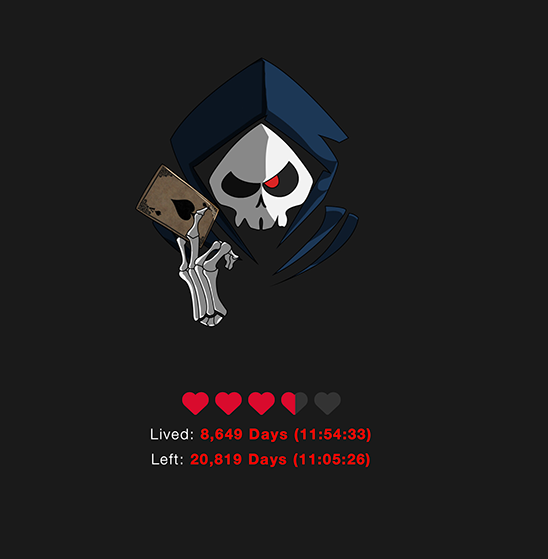

# Time Remaining 💀 for [Übersicht](http://tracesof.net/uebersicht/)

A simple countdown widget to your ultimate demise.
Maybe it's motivational, or maybe it's not?



## Features


* Heart-shaped progress bar, showing % remaining
* Lived time as Day (HH:mm:ss)
* Left time as Day (HH:mm:ss)

## Getting Started

Open the `TimeRemaining.jsx` that you should have copied
to your Widgets folder.

Next, update the settings object with our `birthday`, `lifeExpectancy`,
and any other settings you wish to change.

```js
const settings = {
  birthday: new Date("2000-01-01T00:00:00"), // your birthday, ignore the time part
  lifeExpectancy: 80, // how many years you expect to live
  style: {
    top: "70%",
    left: 0,
    right: 0,
    bottom: 0,
    heartSize: "40px",
    heartColor: "#D90A2C",
    heartBackgroundColor: "#333333",
  },
};
```

## Wallpaper

If you like the background, you can [snag it here](https://www.artstation.com/artwork/189aEo).

## [Download Time Remaining](https://github.com/jaredmeakin/ubersicht-time-remaining/releases/latest)
